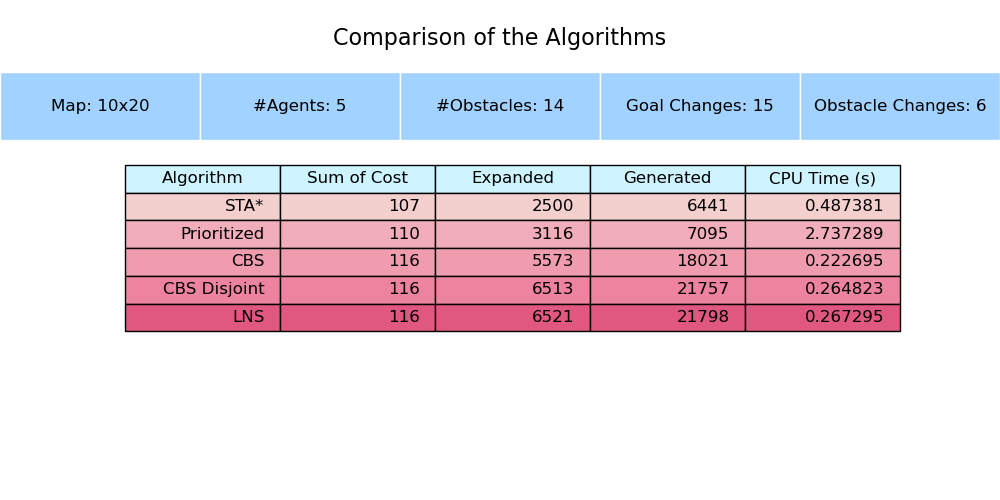

# Dynamic Multi-Agent Path Finding (Dynamic MAPF)
This project investigates how various algorithms perform under Dynamic Multi-Agent Path Finding (MAPF) conditions. Dynamic MAPF introduces additional complexity to the traditional MAPF problem by incorporating changes to the environment, such as newly appearing or disappearing obstacles and shifting agent goals.

## Contributers:
- Saba Siddiqi  
- Sahba Hajihoseini  
- Hani Nguyen  

**Fall 2024**

## Objectives
Our research focuses on:

* Algorithm Performance: Evaluating Space-Time A*, Prioritized Planning, Conflict-Based Search (CBS), and Large Neighborhood Search (LNS) in dynamic scenarios.
* Scalability: Understanding how these algorithms handle increasing agent counts and more complex map layouts.
* Path Optimality: How close solutions are to the shortest possible paths.
* Replanning Efficiency: The computational effort required to adapt to changing goals and obstacles.
* Scalability: Performance stability as the number of agents or map complexity increases.
* Robustness: Consistency and reliability of solutions under frequent and significant environmental changes.
By comparing these metrics, we aim to identify the trade-offs and strengths of each algorithm and provide practical insights for real-world applications that require dynamic planning and coordination.

## Map Configurations
We created multiple series of maps, each designed to highlight different aspects of the problem:

* Obstacle Frequency Series: Maps that vary how often obstacles appear or disappear.
* Goal Frequency Series: Maps that change agent goals at different rates.
* Agent Count Series: Maps that keep dynamics consistent but adjust the number of agents.
* Large Neighborhood vs Localized Changes Series: Maps where all changes are concentrated in a small area vs. spread evenl.
* Highly Dynamic Series: Maps with frequent and numerous changes to obstacles and goals, testing rapid replanning.
* Critical Goal Series: Goal changes send agents to difficult or far locations, testing adaptability.
* Randomly Generated Series: Changes occur at random times and locations to test average-case adaptability.

Each series allows us to isolate and study the effect of one factor (e.g., obstacle frequency) on algorithm performance. 
Sample map (`maps/goal_frequency_s3_map3.json`):


## Running the Algorithms
You can run a single algorithm on a given map:

```bash
python3 main.py maps/<input_file> --algorithm <chosen algorithm>
```
from a list of algorithms:
```bash
<chosen algorithm> = STA*, Prioritized, CBS, "CBS Disjoint", LNS
```
Sample:
```bash
python3 main.py d_map4.json --algorithm "CBS Disjoint"
```


To run all algorithms on a map and compare their performance:
```bash
python3 run_all_algorithms.py maps/<input_file>
```
Sample: 
```bash
python3 run_all_algorithms.py maps/goal_frequency_s3_map2.json
```

Sample output:  

